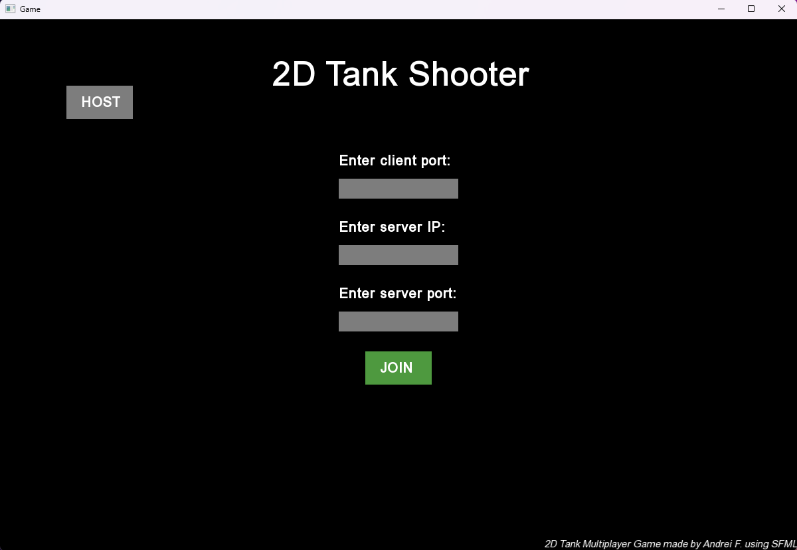

# 2D Tank Shooter Game
A 2 player multiplayer game that utilizes the SFML graphics and network libraries.

Two clients are able to connect to a server through UDP sockets. The clients and server communicate via packets, where the packets resemble client status connection, projectile information, and the tank barrel rotation. 

The main menu client UI is made using the SFML graphics library, where the client is able to input their desired port, the server IP and server port. If the information was inputted correctly, they will be able to join the game.

The game ends with one of the players being hit by a projectile or exiting the game.

Inspired by Tank Wars.

# Controls
W - increases the power of the projectile

S - decrease the power of the projectile

A - rotates player barrel to the left

D - rotates player barrel to the right

Space - shoots projectile (if it's the player's turn)

# Images

Image of the main menu UI, which is what the client sees when opening the game.


Image of both players connected at once, the left being Player 1, and the right being Player 2.


Image of Player 1 shooting.

# [Demo Video](https://youtu.be/AL8oMHDAfvk)

# How to Build & Run

```bash
# CMake Minimum Version 3.27
cmake -B build -S .
cmake --build build
./build/game c #for client
./build/game s #for server
```

# Credits
Tank images by: www.kenney.nl
